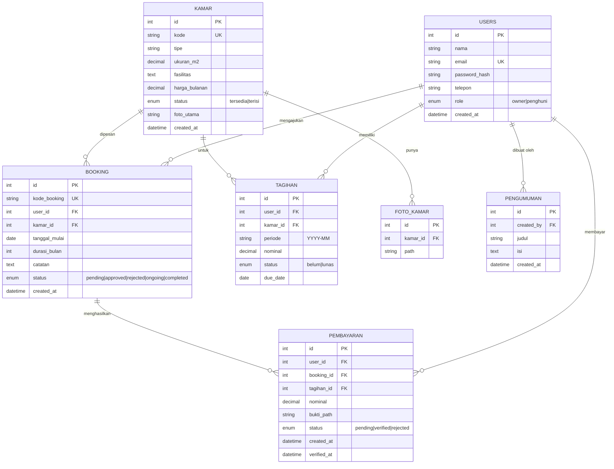

# ERD — Sistem Manajemen Kos & Indekos

## Diagram (Mermaid)

## Catatan Relasi

- 1 USER (penghuni) bisa punya banyak BOOKING & TAGIHAN.
- 1 KAMAR bisa punya banyak FOTO & banyak BOOKING (historis).
- 1 BOOKING setelah approved akan otomatis generate TAGIHAN bulanan (sebanyak `durasi_bulan`).
- PEMBAYARAN terhubung ke TAGIHAN spesifik (1 tagihan → 1 pembayaran verified).
- Status kamar otomatis update ke "terisi" saat booking approved, "tersedia" saat completed.
